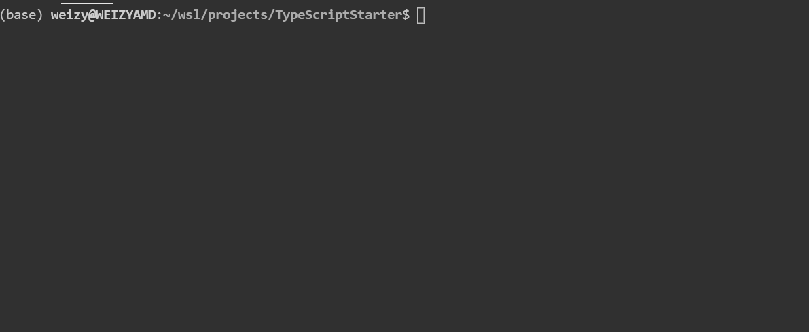
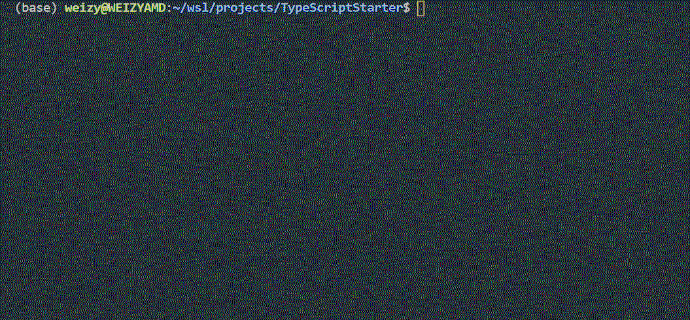
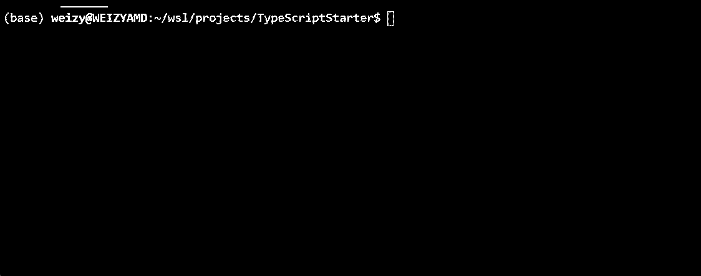

[English](./README.md)  |  [中文文档](./README_ZH.md)
# TypeScriptStarter
A TypeScript Starter Project to build basic scaffold and implement different functions original from javascript

## 1. General
This project's object is to set up basic typescript development enviroment with necessary packages, so as to help developers quickly start project coding.
The purpose of basic functions includes :
- [x] Basic typescript project scaffold with project structure and typescript, ts-node and @types/node packages.
- [x] Docs generation functions with typedoc and @vamship/grunt-typedoc packages.
- [x] Less package with additional setup to generate css files.
- [ ] Grunt automation toolbox with necessary packages (which might be replaced with gulp? in the future, and additional functions to be added) 
- [ ] Lint functions
- [x] Jest/Jasmine test enviroment developement enviroment
- [ ] Electron desktop application developement enviroment
- [ ] nodejs and express basic web developement enviroment 
- [ ] mongoose and mysql database development enviroment
  
The `helloworld` branch is intend to cover most of above functions except web development and database, which will be divided into independent branches.

## 2. How to start

The project is build with VS Code, and it is strongly recommanded to install `TypeScript Hero` 
- clone current project and run `npm install` under root dir
- Run `grunt` to start compile and watch
- See `package.json` and `Gruntfile.js` for detailed command

Some scaffold initial sample as following, you can follow the steps to start your own project:
1. To compile typescript and initialize a project

2. To setup the project file structure of a project:

3. To setup and use grunt

## 3. Functions

## 4. Brunches
